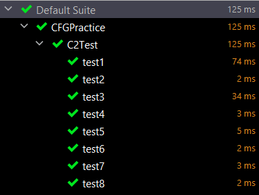
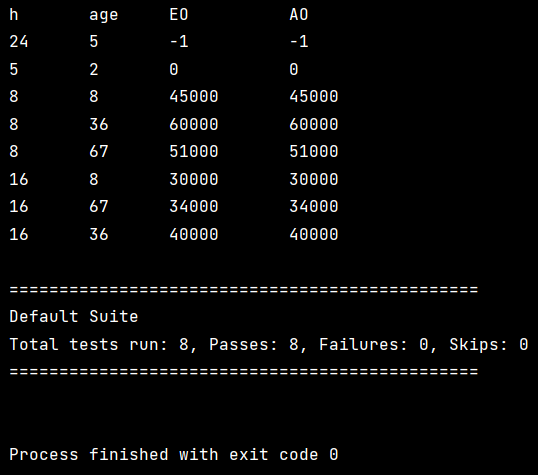

# KIỂM THỬ DÒNG ĐIỀU KHIỂN CHO BÀI TOÁN TÍNH GIÁ VÉ TÀU

## Sinh viên thực hiện
- Họ và tên: Quách Ngọc Minh
- Mã sinh viên: 20020261
- Github repository: <https://github.com/Mint18032/CFGPractice>

## Mục lục
- [Nội dung bài toán](#Nội-dung-bài-toán)
  - [Đặc tả](#Đặc-tả)
  - [Đoạn mã được kiểm thử](#Đoạn-mã-được-kiểm-thử)
- [Quá trình sinh testcase](#Quá-trình-sinh-testcase)
  - [Đồ thị dòng điều khiển (CFG)](#Đồ-thị-dòng-điều-khiển-(CFG))
  - [Testcases cho độ phủ C2](#Testcases-cho-độ-phủ-C2)
- [Kiểm thử](#Kiểm-thử)
    - [Mã nguồn bộ test sử dụng TestNG](#Mã-nguồn-bộ-test-sử-dụng-TestNG)
    - [Kết quả](#Kết-quả)

## Nội dung bài toán
Giả sử các chuyến tàu khởi hành từ 0h đến trước 9h và từ 17h đến trước 19h (giờ cao điểm)
có giá 60000 đồng, các chuyến khởi hành từ 9h đến 17h và từ 19h đến trước 24h
có giá 40000 đồng. Trẻ em dưới 6 tuổi được miễn vé tàu,
trẻ từ 6 đến 10 tuổi được giảm 25%, người cao tuổi từ 60 tuổi được giảm 15%.
Cho rằng tàu chỉ khởi hành vào các giờ đúng
và giá trị tuổi khách hàng trong khoảng từ 0 đến 200.
Phương thức `int trainFareCalculate()` tính giá vé tàu khi cho biết giờ khởi hành và tuổi khách hàng, trả về -1 với đầu vào không hợp lệ.

### Đặc tả
Gọi h là giờ tàu khởi hành, age là độ tuổi khách hàng.
Ta có:
* h, age &#8712; N (kiểu Int)
* h &#8712; [0, 24)
* age &#8712; \[0, 200]

Ta có bảng giá trị đầu ra dựa theo đầu vào như sau:

|STT| Điều kiện đầu vào  | Đầu ra  |
|---|---|---|
| 1|h &#8712; (MinInt, 0) &#8746; [24, MaxInt), age bất kì |-1|
| 2|h bất kì, age &#8712; (MinInt, 0) &#8746; (200, MaxInt)|-1|
| 3| h &#8712; [0, 24), age &#8712; [0, 6)                 |0|
| 4|h &#8712; \[0, 9) &#8746; \[17, 19), age &#8712; \[6, 10]|45000|
| 5|h &#8712; \[9, 17) &#8746; \[19, 24), age &#8712; \[6, 10]|30000|
| 6|h &#8712; \[0, 9) &#8746; \[17, 19), age &#8712; (10, 60)|60000|
| 7|h &#8712; \[9, 17) &#8746; \[19, 24), age &#8712; (10, 60)|40000|
| 8|h &#8712; \[0, 9) &#8746; \[17, 19), age &#8712; \[60, 200]|51000|
| 9|h &#8712; \[9, 17) &#8746; \[19, 24), age &#8712; \[60, 200]|34000|

### Đoạn mã được kiểm thử
[trainFareCalculating.java](./src/main/java/trainFareCalculating.java)

```java
public class trainFareCalculating {

    public static int trainFareCalculate(int h, int age) {
        if(!isValidAge(age) || !isValidHour(h)) {
            return -1;
        }
        if (age >= 0 && age < 6) {
            return 0;
        }
        if (isPeakHour(h)) {
            if (age >= 6 && age <= 10) return 45000;
            if (age > 10 && age < 60) return 60000;
            return 51000;
        }
        // (h >= 9 && h < 17) || (h >= 19 && h < 24)
        if (age >= 6 && age <= 10) return 30000;
        if (age > 10 && age < 60) return 40000;
        return 34000;
    }


    /**
     * @param h hour
     * @return true if the hour is valid.
     */
    private static boolean isValidHour(int h) {
        return (h >= 0 && h < 24);
    }

    /**
     * @param age age of customer
     * @return true if the age is valid.
     */
    private static boolean isValidAge(int age) {
        return (age >= 0 && age <= 200);
    }

    /**
     * @param h hour
     */
    private static boolean isPeakHour(int h) {
        return (h >= 0 && h < 9) || (h >= 17 && h < 19);
    }
}
```

## Quá trình sinh testcase
### Đồ thị dòng điều khiển (CFG)
Dựa vào mã nguồn, ta có đồ thị dòng điều khiển sau:
j

### Testcases cho độ phủ C2
| ID | Input h | Input age | Expected Output |
|---|---|---|---|
| 1| 24 | 5 |-1|
| 2| 5  |2 |0 |
| 3|8|8|45000|
| 4|8|36|60000|
| 5|8|67|51000|
| 6|16|8|30000|
| 7|16|67|34000|
| 8|16|36|40000|

## Kiểm thử
### Mã nguồn bộ test sử dụng TestNG
[C2Test.java](./src/test/java/C2Test.java)

```java
public class C2Test {

  @Test
  public void test1() {
    int h = 24;
    int age = 5;
    int EO = -1;
    int price = trainFareCalculating.trainFareCalculate(h, age);
    System.out.println("h\t\tage\t\tEO\t\t\tAO");
    System.out.println(h + "\t\t" + age + "\t\t" + EO + "\t\t\t" + price);
    Assert.assertEquals(price, EO);
  }

  @Test
  public void test2() {
    int h = 5;
    int age = 2;
    int EO = 0;
    int price = trainFareCalculating.trainFareCalculate(h, age);
    System.out.println(h + "\t\t" + age + "\t\t" + EO + "\t\t\t" + price);
    Assert.assertEquals(price, EO);
  }

  @Test
  public void test3() {
    int h = 8;
    int age = 8;
    int EO = 45000;
    int price = trainFareCalculating.trainFareCalculate(h, age);
    System.out.println(h + "\t\t" + age + "\t\t" + EO + "\t\t" + price);
    Assert.assertEquals(price, EO);
  }

  @Test
  public void test4() {
    int h = 8;
    int age = 36;
    int EO = 60000;
    int price = trainFareCalculating.trainFareCalculate(h, age);
    System.out.println(h + "\t\t" + age + "\t\t" + EO + "\t\t" + price);
    Assert.assertEquals(price, EO);
  }

  @Test
  public void test5() {
    int h = 8;
    int age = 67;
    int EO = 51000;
    int price = trainFareCalculating.trainFareCalculate(h, age);
    System.out.println(h + "\t\t" + age + "\t\t" + EO + "\t\t" + price);
    Assert.assertEquals(price, EO);
  }

  @Test
  public void test6() {
    int h = 16;
    int age = 8;
    int EO = 30000;
    int price = trainFareCalculating.trainFareCalculate(h, age);
    System.out.println(h + "\t\t" + age + "\t\t" + EO + "\t\t" + price);
    Assert.assertEquals(price, EO);
  }

  @Test
  public void test7() {
    int h = 16;
    int age = 67;
    int EO = 34000;
    int price = trainFareCalculating.trainFareCalculate(h, age);
    System.out.println(h + "\t\t" + age + "\t\t" + EO + "\t\t" + price);
    Assert.assertEquals(price, EO);
  }

  @Test
  public void test8() {
    int h = 16;
    int age = 36;
    int EO = 40000;
    int price = trainFareCalculating.trainFareCalculate(h, age);
    System.out.println(h + "\t\t" + age + "\t\t" + EO + "\t\t" + price);
    Assert.assertEquals(price, EO);
  }
}
```

### Kết quả
| ID | Input h | Input age | Expected Output | Actual Output | Result |
|---|---|---|---|---|---|
| 1| 24 | 5 |-1|-1|Passed|
| 2| 5  |2 |0 |0 |Passed|
| 3|8|8|45000|45000|Passed|
| 4|8|36|60000|60000|Passed|
| 5|8|67|51000|51000|Passed|
| 6|16|8|30000|30000|Passed|
| 7|16|67|34000|34000|Passed|
| 8|16|36|40000|40000|Passed|





Như vậy, bộ test không phát hiện ra lỗi của chương trình.